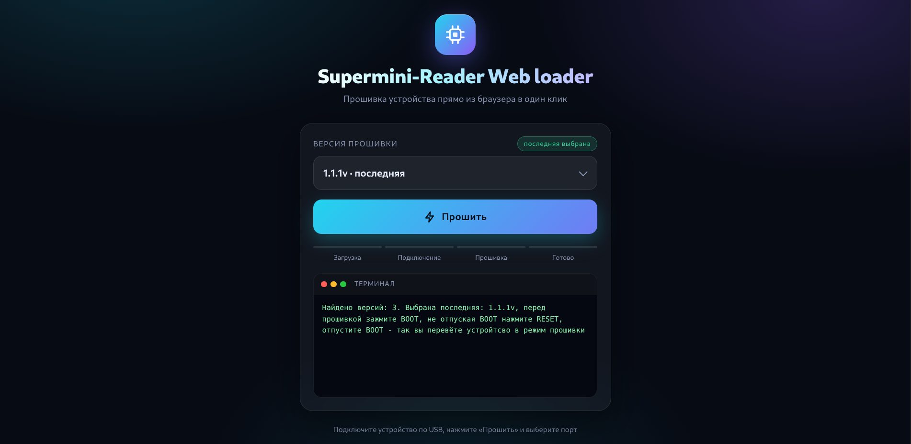

# 📟 Supermini-Reader
**Карманная цифровая шпаргалка** на базе микроконтроллера ESP32-S3 SuperMini. С помощью этого устройства вы можете читать текст, загруженный через веб страницу 


---

### ⚠️ Дисклеймер
Создатель прошивки не несет ответственность за ваши действия. Если вас спалили я не виновен

*Использование прошивки означает ваше полное согласие с этими условиями*  

---
## Инструкция
**Кнопка вверх и вниз** - позволяют выбирать файл, листать страницы и регулировать яркостью (в Wifi режиме)

__Кнопка ОК__ - позволяет открывать/закрывать файлы, если зажать можно включить Wifi режим

---
## Обновление 1.1v

> [!WARNING]
> ПЕРЕПРОШИВАЙТЕ НА ИСПРАВЛЕННУЮ ВЕРСИЮ - 1.1.1v

> [!WARNING]
> ЕСЛИ БУДЕТЕ ПЕРЕПРОШИВАТЬ УСТРОЙСТВО С 1.0v на 1.1v НЕОБХОДИМО УДАЛИТЬ ВСЕ ФАЙЛЫ, Т.К. ИЗМЕНЕН ota_cs, РАЗМЕТКА ПАМЯТИ ДРУГАЯ ВЫ ПОВРЕДИТЕ УСТРОЙСТВО (в новом под файлы выделено теперь 2,9 МБ > памяти, если не хотите ничего менять, то прошивайте с новым кодом не меняя ota_cs, не прошивайте bin)  

- Встроенный калькулятор
- Добавление папок
- Изменение имя сети и пароля
- Режим левши (поворот экрана 180 градусов)
- Автозасыпание по таймеру (задается в веб)
- Отображение занимаемое шпаргалкой место
- Выбор темы в веб интерфейса

### Прочие изменения

 - Изменение ЛУТ/PDF


---
### Как загрузить пошагово
1) Зажимаем кнопку ОК (ждем включение Wifi режима)
2) Открываем на телефоне, ПК Wifi сети и ищем точку доступа которая написана на экране
3) Кликаем и вводим пароль (тоже написано на экране)
4) На телефоне автомотически перекидывает на нужную веб страницу, на ПК открываем браузер и вводим IP (тоже написано на экране)
5) Вводим любой заголовок и текст (на русском или английском языке)
6) После загрузки зажимаем ОК на устройстве и нас перекидывает на главное меню, и там нас ждет загруженный файл

По умолчанию стоит такое имя сети и пароль (по желанию можно изменить, если пароль пустой то сеть будет открытой, хотя поменять можно через веб): 
``` cpp
String AP_SSID = "Esp hpora";
String AP_PASS = "12345678";
```
> [!WARNING]
> На IOS нельзя удалять файлы, только изменять содержимое файлов и загружать новые

---

| Компонент | Ссылка |
|-----------|--------|
| ESP32-S3 supermini | [AliExpress](https://ali.click/authk16) |
| OLED 0.96 | [AliExpress](https://ali.click/0sthk16) |
| Кнопки | [AliExpress](https://ali.click/zmthk1m) |
| Переключатель | [AliExpress](https://ali.click/nm4xl1j) |
| Текстолит (двухсторонний) | [OZON](https://ozon.ru/t/EIpMMhm) |
| Преобразователь 5v,8v,9v,12v |[AliExpress](https://ali.click/431kk1u)|
| TP4056 |[AliExpress](https://ali.click/2v3xl17)|
| Аккумулятор (любой, рекомендуется 402025) |[Ozon](https://ozon.ru/t/sXkcoqy)|

 ---

#### Схема подключения

|Module|Pin 1|Pin 2|Pin 3|Pin 4|
|--------|--------|--------|--------|--------|
|**📺 Display**|VCC→3V3|GND→GND|SCL→G13|SDA→G11|
|**🔘 Buttons**|UP→G5|DOWN→G7|OK→G6|-|


---

### ❓ Как прошить ❓

Переходим в мой веб загрузчик -> https://razeb1t.github.io/Supermini-Reader-Web-loader.io/
Выбираем нужную версию, на устройстве (точнее на МК) зажимаем BOOT, не отпуская BOOT нажимаем RESET, отпускаем BOOT - так устройство переводится в сосотояние прошивки



После прошивки обесточьте устройство и затем включите

Или (более муторный вариант) скачиваете 3 bin файла - botloader, partitions и firmware, переходите в веб загрузчик https://esptool.spacehuhn.com/, загружаете эти файлы и выставляете адреса:
botloader: 0
partitions: 8000
firmware: 10000
(без "0x" впереди)

---
## Изготовление

> [!NOTE]
> **ГАЙД УЖЕ НА [YOU TUBE!!!](https://youtu.be/IHZwgPZnhfI?si=5LoymI1fk4fz2pAS)**

Печатаем на глянцевой бумаге схему (в файле ЛУТ) **ВАЖНО РАЗМЕР 1 к 1** 

Более подробный и простой гайд от **AlexGyver про ЛУТ** 
[**You Tube**](https://youtu.be/NJTeIALlztI)

После успешного изготовление платы **ПРИМЕЧАНИЕ**, нужно отпаять 2 резистора на преобразователе а именно A и B
